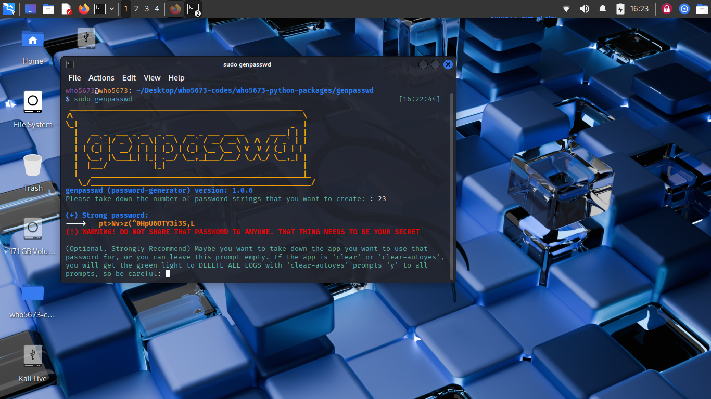
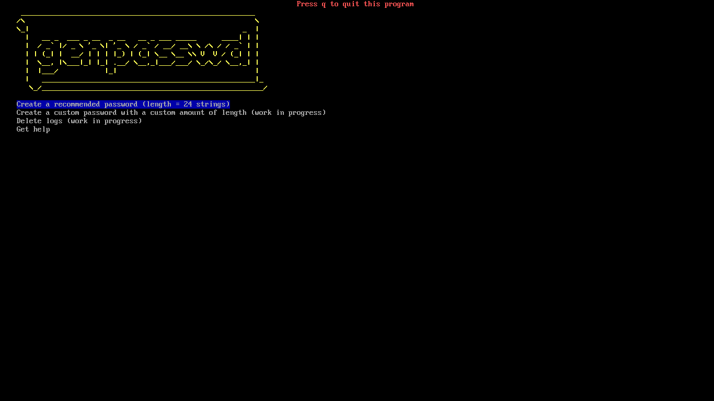

# genpasswd

**genpasswd** (written in python3, library python3-rich and some standard python ones) is a Command Line Interface (CLI) app that generates strong passwords and logs every generating actions while using it. It use a file system which has /var/log/secrof.log as a path to a log file to take down every passwords generated with the exactly time in the past.
**genpasswdtui** (written in C, library ncurses.h in libncurses-dev and some standard C ones) is a Text-based User Interface app for genpasswd, but you can only use your keyboard to control that app and it is under progress of building. In the future, it is predicted that we will support mouse button soon.

genpasswd app being opened in xfce4 Desktop (Kali Linux).

genpasswdtui app being opened in Kali Linux Text TeleTYpewriter tty2.

## Standout features:
- **Generate strong passwords:**

License: MIT
Some ideas assisted by ChatGPT - (c) genpasswd, who5673, June 2025. All rights served.
You can support us to improve this application in the future, but do not vandalize this project or make another copyright of it.
