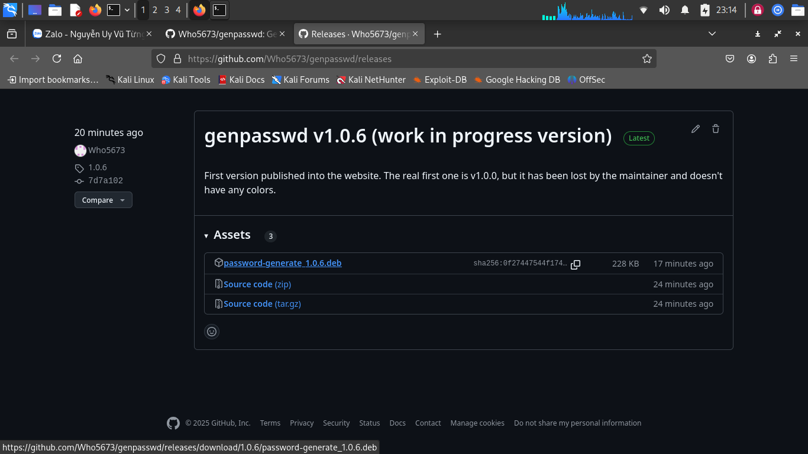
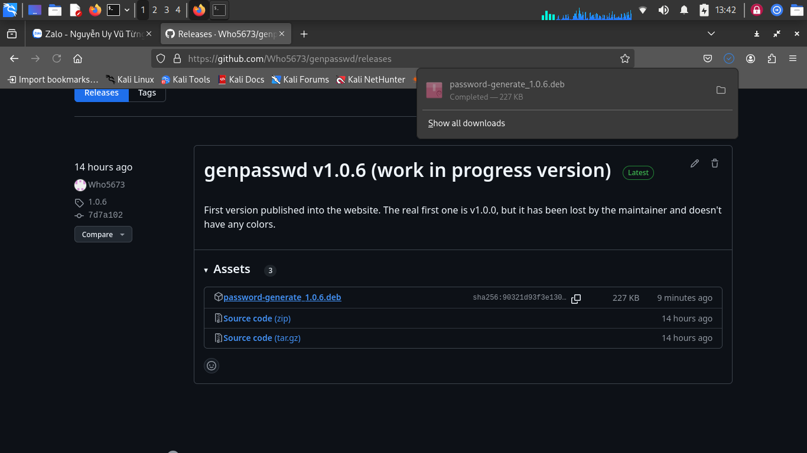

# genpasswd

**genpasswd** (written in python3, library python3-rich and some standard python ones) is a Command Line Interface (CLI) app that generates strong passwords and logs every generating actions while using it. It use a file system which has /var/log/secrof.log as a path to a log file to take down every passwords generated with the exactly time in the past.  
**genpasswdtui** (written in C, library ncurses.h in libncurses-dev and some standard C ones) is a Text-based User Interface app for genpasswd, but you can only use your keyboard to control that app and it is under progress of building. In the future, it is predicted that we will support mouse button soon.

genpasswd app being opened in xfce4 Desktop (Kali Linux).

genpasswdtui app being opened in Kali Linux Text TeleTYpewriter tty2.

## Standout features:
- **Generate strong passwords:** 
After running `genpasswd`, you will be prompted to take down the length, the strong password will be generated, and then after doing that, the app will ask you that you want to clear logs, take down apps that you want to save or do nothing (if leave empty).

    About `genpasswdtui`, the options will be seen by you so you can control it using arrows (up, down, left, right) and Enter key to interact (same as right arrow).

## Requirements and dependencies
**This app needs those requirements in PyPI are:**
- `rich` (needs to have colors)
Note: You can install python3 libraries (`python3-xyz`, which xyz is a library name) from apt, like `python3-rich`
**Those apps needs to be installed as the dependencies of genpasswd from the system are:**
- `libncurses-dev` (It has `ncurses.h` to run TUI apps, from Advanced Package Tool - `apt`)
- `figlet` (to make ASCII logos, from apt)

## Installation:
2 ways to install genpasswd: (Debian Packages and GiHub and setup.py. In the future, we will have another one for Flatpak)
### 1. Install via Debian Packages (from `dpkg` or `gdebi`)
- If you use GDebi Package Installer to install, please install gdebi via apt or software/app center first:
    `sudo apt update && sudo apt --yes install gdebi # You do not have to use 'sudo apt update' if you do not want to use the latest gdebi`
- Go to this link: https://github.com/Who5673/genpasswd/releases
- From the latest release, choose password-generate_1.0.6.deb

- Wait until the progress is completed.

- Install .deb file using gdebi or dpkg.  
        **Using gdebi CLI: Open the Terminal (Ctrl+Alt+T or the Terminal icon) and execute this command:**  
  
        `sudo gdebi /path/to/password-generate.deb # Can use relative path instead of absolute one`  
        **Using dpkg: Open the Terminal and execute this command:**:  
  
        `sudo dpkg -i /path/to/password-generate; sudo apt --fix-broken install # You can use --install instead of -i`  
        **Using GDebi Package Installer** (`gdebi-gtk`) **,follow these methods:**  
        - Step 1:
- **Cautions**:
        As dpkg cannot automatically solve dependencies, so you may need to use `sudo apt --fix-broken install` to solve them.
        If you have changed attribute (`chattr`) some system directories, please `chattr -i -a /usr /bin ...` first.
- Test file by using this command: `genversion`. If it returns to a version, it means that you have done the installation.
### 2. Install by cloning this website
- Clone this website:
        `git clone https://github.com/Who5673/genpasswd/releases`

License: MIT
Some ideas assisted by ChatGPT - (c) genpasswd, who5673, June 2025. All rights served.
You can support us to improve this application in the future, but do not vandalize this project or make another copyright of it.
